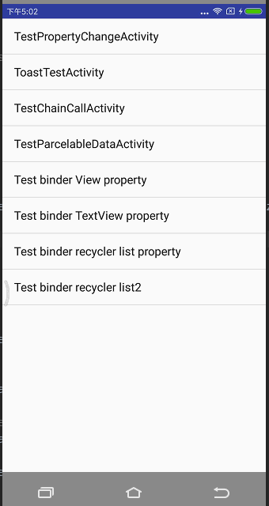

data-mediator
=======================================
 

 see [English document](https://github.com/LightSun/data-mediator/wiki/Main-of-Dara-mediator) by click this.
- 一个数据层的框架。利用编译时注解技术， 在java和android平台自动生成 数据实体及相关的代码。
  方便数据层的使用。支持gson. 通过操作binder和代理 实现绝大部分开发属性设置。（setText, setTextColor 等等）
 <br>支持数据统计(即将上线)

# 文档导航
 * [问题及目标](#问题及目标) 
 * [设计思想](#设计思想)
 * [特点](#特点)
 * [快速入门](#快速入门)
 * [简易教程](https://github.com/LightSun/data-mediator/blob/master/docs/zh/courses.md)
 * [进阶指南](#进阶指南)
 * [混淆配置](#混淆配置)
 
# 问题及目标
* 现有问题：
<br>通常况下我们写app: 需要写很多实体,常用的就是和server交互的实体.
<br>在版本不断迭代的情况下,数据模型可能会很很多次(CRUD 字段甚至直接删除整个module).
<br>即使我们使用parcelable 代码生成器,也经常要ALT+insert去重新生成。toString那些更不用说了。
<br>而且如果用gson注解映射， 就更不太方便了。
<br>如果想链式编程....也不方便。
<br>...
* 基于此，我设计了这个数据中介者框架。
* 它的目标:
<br>由于数据层是直接和业务打交道。很可能经常变动。为了减小这种变动。我想出了数据中介者框架(data-mediator).
<br>当然它还会支持很多特性. 未来还会完成更加复杂业务任务.

# 设计思想
- 整个设计分3层： 模型层，代理层，调用层

- 模型层：代表的是数据模型接口and实现
- 代理层：数据实体的代理
- 调用层：操作模型和代理的

# 特点
- 自动生成数据的接口和实现类.可自动实现Serializable和 Parcelable(android)接口。
  <br>自动生成get/is , set , toString方法.
  <br>自动生成代理层 以便监听数据变化。
- 字段:
  * 1, 支持多种类型 , 8大基本类型(int,long,short,byte,float,double,boolean ,char)及其包装类型， String类型, 
   <br> 和其他类型 .数组和list结构同样支持。（map暂不支持parcelable）
  * 2, 支持生成字段的gson注解 for 'Google-Gson'.
  * 3, 支持多域， 比如： 重置(IResetable接口), 拷贝（ICopyable接口), 共享（Shareable), 快照（ISnapable)接口。toString.
  <br>     作用: 比如重置： 很多时候我们调用了数据的一些方法，改变了一些属性。然后想重置以便重新使用。
  <br>     比如 toString. 可选择某些字段参加或者不参加toString方法. hashCode和equals同理
  
- 支持List属性编辑器。 （相当于对list的增删改增加了便捷操作）
      
- 支持依赖或继承 @Field注解的接口（代表数据实体). 继承只能继承一个。
   * 平常我们写 BaseEntity(内有代表http/https响应的code, message, data字段）, 通常业务接口的数据会继承这个BaseEntity。
     <br> 所以这里规定 继承@Field注解的接口（代表数据实体) 只能一个。否则error.
    
- 支持链式调用. data-mediator-compiler 1.0.9 之后默认链式。
   <br>1), 如果需要回到普通的java bean. 则需要将注解 @fields的方法 boolean enableChain()。 返回false. 
   <br>2), 需要注意的是，如果模型之间有继承关系。则需要将父module定义的enableChain 和 child的 enableChain 值相同, 否则编译错误。
   <br>3), 下面是示例：
 ```java
  DataMediator<StudentModule> mediator = DataMediatorFactory.createDataMediator(StudentModule.class);
        //数据代理层
        mediator.getDataProxy()
                .setName(null)
                .setAge(0)
                .setId(0);

        //数据真正的模型实现
        mediator.getData().setName(null)
                .setAge(0)
                .setId(0);
 ```
 - 支持数据缓存 (使用请参考下面[进阶指南](#进阶指南))
 - 支持android平台的双向绑定, 新增万能的Binder. 支持绑定任意控件的属性。(常用的已经集成)
 <br> 绑定以后操作数据代理就是操作view. (使用请参考下面[进阶指南](#进阶指南))


# 快速入门

1, 在项目根目录添加apt依赖。
```java
 classpath 'com.neenbedankt.gradle.plugins:android-apt:1.8'
```

2, 在使用的app module中加入。apt plugin
```java
   apply plugin: 'com.neenbedankt.android-apt'
```

3, 添加dependencies
```java
dependencies {
    //......
    compile 'com.heaven7.java.data.mediator:data-mediator:<see release>'
    compile 'com.heaven7.java.data.mediator.annotation:data-mediator-annotations:<see release>'
    apt 'com.heaven7.java.data.mediator.compiler:data-mediator-compiler:<see release>'
    apt 'com.squareup:javapoet:1.9.0'
    
    // 如果需要生成对应的gson注解。请加入gson依赖。比如
    compile "com.google.code.gson:gson:2.7"
    // 如果要支持android平台的数据绑定. 请添加依赖
    compile 'com.heaven7.android.data.mediator:data-mediator-android:<see release>'
}
```

4, 开始定义你的数据实体。比如我要定义关于学生的数据模型, 需要实现Serializable, Parcelable. 
假如学生有。年龄，名称, id属性。
那么简单的数据定义为:
```java

@Fields({
        @Field(propName = "age" , type = int.class, flags = FLAGS_ALL_SCOPES),
        @Field(propName = "name" , type = String.class, flags = FLAGS_ALL_SCOPES),
        @Field(propName = "id" , type = long.class, flags = FLAGS_ALL_SCOPES),
})
public interface Student extends Serializable, Parcelable{
}
```

5, 点击android studio 工具栏上的图标

   

  即可自动生成代码（数据定义没变化，不会重新生成）。


6, 调用示例 （来自data-mediator-demo下的[TestViewBindActivity](https://github.com/LightSun/data-mediator/blob/master/Data-mediator-demo/app/src/main/java/com/heaven7/data/mediator/demo/activity/TestViewBindActivity.java)）
```java
/**
 * 测试 绑定view控件的基本属性: setBackground, setBackgroundColor,setBackgroundResource.setEnable等
 * Created by heaven7 on 2017/9/24.
 */
public class TestViewBindActivity extends BaseActivity {

    @BindView(R.id.v_enable)
    View mV_enable;
    @BindView(R.id.v_bg)
    View mV_bg;
    @BindView(R.id.v_bg_color)
    View mV_bg_color;
    @BindView(R.id.v_bg_res)
    View mV_bg_res;

    private Binder<ViewBindModule> binder;

    private Drawable mDrawable1;
    private Drawable mDrawable2;
    private int mResId1;
    private int mResId2;
    private int mColor1;
    private int mColor2;

    private boolean mUserDrawable1;
    private boolean mUserRes1;
    private boolean mUserColor1;

    @Override
    protected int getLayoutId() {
        return R.layout.ac_test_view_bind;
    }

    //com.heaven7.android.data.mediator.
    @Override
    protected void onInit(Context context, Bundle savedInstanceState) {

        initResource(context);
        mUserDrawable1 = true;
        mUserRes1 = true;
        mUserColor1 = true;

         binder = DataMediatorFactory.createBinder(ViewBindModule.class);
        //初始化属性。
         binder.getDataProxy()
                 .setBackground(mDrawable1)
                 .setBackgroundColor(mColor1)
                 .setBackgroundRes(mResId1)
                 .setEnable(true);


        // 设置属性拦截器，用于应用绑定的时候过滤一些不需要的属性值。
        binder.setPropertyInterceptor(PropertyInterceptor.NULL_AND_ZERO);
        //绑定并 首次应用属性(绑定只需要1次)
         binder.bindBackground(ViewBindModule.PROP_background, mV_bg)
                         //使用生成的property对象。有助于模型变化后用的地方知晓改变。
                 .bindBackgroundRes(ViewBindModule.PROP_backgroundRes, mV_bg_res)
                 .bindBackgroundColor(ViewBindModule.PROP_backgroundColor, mV_bg_color)
                 .bindEnable("enable", mV_enable)
                 .applyProperties(
                         // 创建一个只接收固定属性的 拦截器。(1.1.2支持的). 只是用于本次apply.
                         PropertyInterceptor.createFilter(ViewBindModule.PROP_background,
                                 ViewBindModule.PROP_backgroundRes,
                                 ViewBindModule.PROP_backgroundColor)
                 );
    }

    @OnClick(R.id.bt_change_bg)
    public void onClickChangeBg(View v){
        //改变背景（drawable）
        binder.getDataProxy().setBackground(mUserDrawable1 ? mDrawable2 : mDrawable1);
        mUserDrawable1 = !mUserDrawable1;
    }

    @OnClick(R.id.bt_change_bg_color)
    public void onClickChangeBgColor(View v){
        //改变背景（color）
        binder.getDataProxy().setBackgroundColor(mUserColor1 ? mColor2 : mColor1);
        mUserColor1 = !mUserColor1;
    }

    @OnClick(R.id.bt_change_bg_res)
    public void onClickChangeBgRes(View v){
        //改变背景（resource id）
        binder.getDataProxy().setBackgroundRes(mUserRes1 ? mResId2 : mResId1);
        mUserRes1 = !mUserRes1;
    }

    @OnClick(R.id.bt_change_enable)
    public void onClickChangeEnable(View v){
        //改变enable 状态
        binder.getDataProxy().setEnable(!binder.getData().isEnable());
    }

    private void initResource(Context context) {
        Resources res = context.getResources();
        mDrawable1 = res.getDrawable(R.mipmap.ic_launcher);
        mDrawable2 = res.getDrawable(R.mipmap.ic_launcher_round);
        mResId1 = R.mipmap.ic_launcher;
        mResId2 = R.mipmap.ic_launcher_round;
        mColor1 = Color.RED;
        mColor2 = Color.GREEN;
    }

    @Override
    protected void onDestroy() {
        binder.unbindAll();
        super.onDestroy();
    }

}

```
* [简易教程](https://github.com/LightSun/data-mediator/blob/master/docs/zh/courses.md)
* 更多sample 代码 见 [demos](https://github.com/LightSun/data-mediator/tree/master/Data-mediator-demo/app/src/main/java/com/heaven7/data/mediator/demo/activity)

# 进阶指南
 * [域和支持的接口说明](https://github.com/LightSun/data-mediator/blob/master/docs/zh/scope_desc.md)
 * [binder-详解](https://github.com/LightSun/data-mediator/blob/master/docs/zh/binder.md)
 * [数据缓存-详解](https://github.com/LightSun/data-mediator/blob/master/docs/zh/data_cache.md) 
 * [api 说明](https://github.com/LightSun/data-mediator/blob/master/docs/zh/api.md)

# 混淆配置
```java
-keepclasseswithmembers public class * implements com.heaven7.java.data.mediator.DataPools$Poolable{
   *;
}
-keepclasseswithmembers public interface * extends com.heaven7.java.data.mediator.DataPools$Poolable{
   *;
}
-keep class * extends com.heaven7.java.data.mediator.BaseMediator{
   *;
}
-keep class com.heaven7.java.data.mediator.BaseMediator
-keep public class com.heaven7.android.data.mediator.BinderSupplierImpl
```

# refer libs
[javapoet](https://github.com/square/javapoet)

# License

    Copyright 2017   
                group of data-mediator
        member: heaven7(donshine723@gmail.com)

    Licensed under the Apache License, Version 2.0 (the "License");
    you may not use this file except in compliance with the License.
    You may obtain a copy of the License at

       http://www.apache.org/licenses/LICENSE-2.0

    Unless required by applicable law or agreed to in writing, software
    distributed under the License is distributed on an "AS IS" BASIS,
    WITHOUT WARRANTIES OR CONDITIONS OF ANY KIND, either express or implied.
    See the License for the specific language governing permissions and
    limitations under the License.


