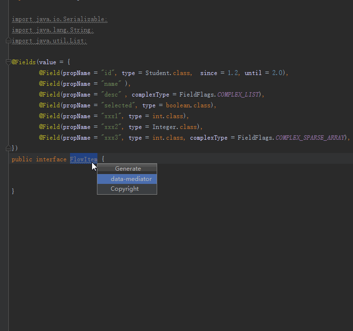

data-mediator
=======================================
| Platform        | compiler   | gson-support  |  binder |  SparseArray | data-binding |
| ------------- | ------------- | ----- | ------- | ------- | ------- |
| java      | ok  | ok | need manual impl |  ok | need manual impl |
| android   | ok  | ok |  ok | ok | ok |


a data-mediator framework which uses annotation processing to generate boilerplate code for you. <br>
[文档还是中文的好](docs/zh/main.md)

# Features
* 1, support listen property change, [Detail](docs/en/listen_property_change.md)
* 2, auto generate get/is/set, hashCode, equals,toString method.
* 3, support chain call. [Detail](docs/en/chain_call.md)
* 4, support impl Serializable and parcelable(android). or others. [Detail](docs/en/parcelable.md)
* 5, full support Annotations of Google/Gson. [Detail](docs/en/gson.md)
* 6, support data-bind for android platform. [Detail](docs/en/data_bind.md)
* 7, support self method. self field. extend self interface you like. [Detail](docs/en/self_method_field.md)
* 8, support data cache.  [Detail](docs/en/data_cache.md)
* 9, support List/SparseArray Editor with their callbacks.  [Detail](docs/en/listen_property_change.md)
* 10, support depend or extend other data model.
* 11, Full support Data-binding on android. [Detail](https://github.com/LightSun/data-mediator/releases/tag/1.4.0)
* 12, full support data-binding in adapter which Can Best Seamless with 'butterknife'.
```java
 public class InnerViewHolder extends DataBindingRecyclerAdapter.DataBindingViewHolder<Student>{

        @BindView(R.id.tv_name) @BindText("name")
        TextView mTv_name;

        @BindView(R.id.tv_age) @BindText("age")
        TextView mTv_age;

        public InnerViewHolder(View itemView) {
            super(itemView);
        }

        @Override
        protected void onPreCreateDataBinding(View itemView) {
            ButterKnife.bind(this, itemView);
        }

        @OnClick(R.id.tv_name)
        public void onClickName(View v){
            //here just toast
            Toast.makeText(v.getContext(), "onClickName is called, pos = "
                    + getAdapterPosition2(), Toast.LENGTH_SHORT).show();
        }
        @OnClick(R.id.tv_age)
        public void onClickAge(View v){
            //here just toast
            Toast.makeText(v.getContext(), "onClickAge is called, pos = "
                    + getAdapterPosition2(), Toast.LENGTH_SHORT).show();
        }
        @OnClick(R.id.bt_change_item)
        public void onClickChangeItem(View v){
            final int pos = getAdapterPosition2();
            getDataProxy()
                    .setAge((int) (System.currentTimeMillis() % 99))
                    .setId(pos)
                    .setName("google+__" + pos);
            //Note: no need notifyItemChanged here.
        }
    }
```
 * Plugin support: <br>
   * the plugin of 'data-mediator-intellij-plugin' used to generate module.<br>
     
   * the plugin of 'data-mediator-convertor-intellij-plugin' used to convert java bean to the base module of this framework.<br>
     

# Install 
 * first , install the plugin of 'data-mediator-intellij-plugin', see it in [release](https://github.com/LightSun/data-mediator/releases/tag/1.4.2).
   * [Optionally] install the convertor plugin . if you want to convert java bean to the module of 'Data-Mediator'.
   click [data-mediator-convertor-intellij-plugin.jar](https://github.com/LightSun/data-mediator/releases/tag/1.4.2) to download
 * java platform(for java/j2ee).
    * 1, gradle.
    ```java
   apply plugin: "net.ltgt.apt-idea"
   apply plugin: 'java'

   buildscript {
       repositories {
           jcenter()
           maven {
               url "https://plugins.gradle.org/m2/"
           }
       }
       dependencies {
           classpath "net.ltgt.gradle:gradle-apt-plugin:0.12"
       }
   }

   repositories {
       jcenter()
       maven {
           url "https://plugins.gradle.org/m2/"
       }
   }
   idea {
       project {
           // experimental: whether annotation processing will be configured in the IDE; only actually used with the 'idea' task.
           configureAnnotationProcessing = true
       }
       module {
           apt {
               // whether generated sources dirs are added as generated sources root
               addGeneratedSourcesDirs = true
               // whether the apt and testApt dependencies are added as module dependencies
               addAptDependencies = true

               // The following are mostly internal details; you shouldn't ever need to configure them.
               // whether the compileOnly and testCompileOnly dependencies are added as module dependencies
               addCompileOnlyDependencies = false // defaults to true in Gradle < 2.12
               // the dependency scope used for apt and/or compileOnly dependencies (when enabled above)
               //PROVIDED
               mainDependenciesScope = "COMPILE" // defaults to "COMPILE" in Gradle < 3.4, or when using the Gradle integration in                                IntelliJ IDEA
           }
       }
   }
   ```
   * 2, idea setting <br>
   
     * (1), setting -> compiler -> annotation Processor ->   more to see [idea](https://www.jetbrains.com/help/idea/configuring-annotation-processing.html)<br>
     * (2), set generate dir to the source/test source dir.
   * 3, add dependencies.
   ```java
   dependencies {
     compile 'com.heaven7.java.data.mediator.annotation:data-mediator-annotations:<see release>'
     compile 'com.heaven7.java.data.mediator.support.gson:data-mediator-support-gson:<see release>'

     compile 'com.heaven7.java.data.mediator:data-mediator:<see release>'
     apt 'com.heaven7.java.data.mediator.compiler:data-mediator-compiler:<see release>'
     apt 'com.squareup:javapoet:1.9.0'
   }
   ```
 * android platform ( for android project) .
   * if you use old gradle version lower of 4.1. such as: '3.5'
     * 1, in the root build file。
     ```java 
      classpath 'com.neenbedankt.gradle.plugins:android-apt:1.8'
     ```
     * 2, in app module add apt plugin
     ```java
        apply plugin: 'com.neenbedankt.android-apt'
     ```
     * 3, add dependencies
     ```java
     dependencies {
         // gson-support( added since 1.2.0)
         compile 'com.heaven7.java.data.mediator.support.gson:data-mediator-support-gson:<see release>'
         compile 'com.heaven7.java.data.mediator:data-mediator:<see release>'

         compile 'com.heaven7.java.data.mediator.annotation:data-mediator-annotations:<see release>'
         apt 'com.heaven7.java.data.mediator.compiler:data-mediator-compiler:<see release>'
         apt 'com.squareup:javapoet:1.9.0'

         // if you want generate annotation of gson。(since 1.2.0 auto added)
         compile "com.google.code.gson:gson:2.8.2"
         // if you want to support data-bind of android
         compile 'com.heaven7.android.data.mediator:data-mediator-android:<see release>'

     }
     ```
   * if you use gradle version >=4.1. use 'annotationProcessor' directly.   
   ```java
    dependencies {
         // gson-support( added since 1.2.0)
         compile 'com.heaven7.java.data.mediator.support.gson:data-mediator-support-gson:<see release>'
         compile 'com.heaven7.java.data.mediator:data-mediator:<see release>'

         compile 'com.heaven7.java.data.mediator.annotation:data-mediator-annotations:<see release>'
         annotationProcessor 'com.heaven7.java.data.mediator.compiler:data-mediator-compiler:<see release>'
         annotationProcessor 'com.squareup:javapoet:1.9.0'

         // if you want generate annotation of gson。(since 1.2.0 auto added)
         compile "com.google.code.gson:gson:2.8.2"
         // if you want to support data-bind of android
         compile 'com.heaven7.android.data.mediator:data-mediator-android:<see release>'

     }
   ```
  
# Quick Start. 

1,[Optional] global configuration.
```java
@GlobalConfig(
        gsonConfig = @GsonConfig(
                version = 2.0,
                forceDisable = false,
                generateJsonAdapter = true
        )
)
```

2, define your data module。eg: if i want to define a student module , 
and need impl Serializable, Parcelable. 
And if the student module has age, name, id property。
thus the simple data module can be define like :
```java

@Fields({
        @Field(propName = "age" , type = int.class),
        @Field(propName = "name" , type = String.class),
        @Field(propName = "id" , type = long.class),
})
public interface Student extends Serializable, Parcelable{
}
```
3, use 'data-mediator-intellij-plugin' generate code, hot key like alt + insert. 
 (you should instanll the plugin , see release).

4, [Optional], compile project (optional , because it will auto generate when before running.)
 * java: mouse right click of module. compile/build (module) XXX
 *  android: click the icon of android studio.
   

5, call sample （from project(data-mediator-demo) [TestPropertyChangeActivity](https://github.com/LightSun/data-mediator/blob/master/Data-mediator-demo/app/src/main/java/com/heaven7/data/mediator/demo/activity/TestPropertyChangeActivity.java)）
```java
/**
 * listen property change demo
 * Created by heaven7 on 2017/9/18 0018.
 */
public class TestPropertyChangeActivity extends BaseActivity {

    @BindView(R.id.tv_desc)
    TextView mTv_desc;

    @BindView(R.id.bt_set_text_on_TextView)
    Button mBt_changeProperty;
    @BindView(R.id.bt_set_text_on_mediator)
    Button mBt_temp;

    DataMediator<Student> mMediator;


    @Override
    protected int getLayoutId() {
        return R.layout.ac_test_double_bind;
    }

    @Override
    protected void onInit(Context context, Bundle savedInstanceState) {
        mBt_changeProperty.setText("click this to change property");
        mBt_temp.setVisibility(View.GONE);

        //create data mediator from data module
        mMediator = DataMediatorFactory.createDataMediator(Student.class);
        //add callback
        mMediator.addDataMediatorCallback(new DataMediatorCallback<Student>() {
            @Override
            public void onPropertyValueChanged(Student data, Property prop, Object oldValue, Object newValue) {
                Logger.w("TestPropertyChangeActivity","onPropertyValueChanged","prop = "
                        + prop.getName() + " ,oldValue = " + oldValue + " ,newValue = " + newValue);
                mTv_desc.setText(String.valueOf(newValue));
            }
        });
        mMediator.getDataProxy().setName("heaven7");
    }

    @OnClick(R.id.bt_set_text_on_TextView)
    public void onClickSetTextOnTextView(View v){
        mMediator.getDataProxy().setName("time: " + System.currentTimeMillis());
    }
}
```
* more sample see [demos](https://github.com/LightSun/data-mediator/tree/master/Data-mediator-demo/app/src/main/java/com/heaven7/data/mediator/demo/activity)

# Proguard
```java
-dontwarn com.heaven7.adapter.**
-keepclasseswithmembers public class * implements com.heaven7.java.data.mediator.DataPools$Poolable{
   *;
}
-keepclasseswithmembers public interface * extends com.heaven7.java.data.mediator.DataPools$Poolable{
   *;
}
-keep class * extends com.heaven7.java.data.mediator.BaseMediator{
   *;
}
-keep class com.heaven7.java.data.mediator.BaseMediator
-keep public class com.heaven7.android.data.mediator.DataMediatorDelegateImpl
-keep class com.heaven7.java.data.mediator.internal.$StaticLoader

# needed since 1.4.0
-keepclasseswithmembers class com.heaven7.java.data.mediator.Binder{*;}
-keepclasseswithmembers class * extends com.heaven7.java.data.mediator.Binder{*;}
-keep public class * extends com.heaven7.java.data.mediator.DataBinding { *; }

```

# Reading The Source
* see [here](https://github.com/LightSun/data-mediator/blob/master/docs/en/reading_source.md).
  
# Using apps
* Data-Mediator is collecting the product list which are using this framework.
Your registration will allow more people to participate and use Data-Mediator.
Data-Mediator will therefore be able to cover more business scenarios. 
if you want please send email(with application logo) to me.

# Thanks
 - [javapoet](https://github.com/square/javapoet)
 - [Google/Gson](https://github.com/google/gson)

# License

    Copyright 2017   
                group of data-mediator
        member: heaven7(donshine723@gmail.com)

    Licensed under the Apache License, Version 2.0 (the "License");
    you may not use this file except in compliance with the License.
    You may obtain a copy of the License at

       http://www.apache.org/licenses/LICENSE-2.0

    Unless required by applicable law or agreed to in writing, software
    distributed under the License is distributed on an "AS IS" BASIS,
    WITHOUT WARRANTIES OR CONDITIONS OF ANY KIND, either express or implied.
    See the License for the specific language governing permissions and
    limitations under the License.


